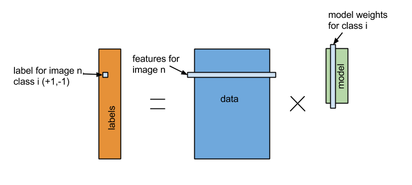
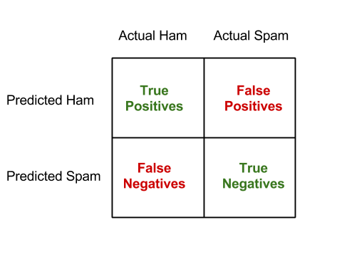

**IMPORTANT** Before you begin reading, you should begin downloading
the KeystoneML exercise materials:

** todo: Insert here

In this chapter, we'll use the KeystoneML framework to build an image classifier and a text classifier.
The goal of the application we're building is to take an
input image and automatically determine what is in it - e.g. a picture of a
bird should return the class "bird." While image classification is one
application that can be supported with the pipelines framework, we hope you'll
leave this exercise convinced that it will be useful for other tasks.

Before getting to the details of the classification task, let's quickly review
the goals of the project and the underlying principles of the framework.

##The KeystoneML Framework

KeystoneML is a software framework designed to make building and deploying large scale machine learning pipelines easier.
To assist developers in this task we have created an API that simplifies common tasks and presents a unified interface
for all stages of the pipeline.

Additionally we've included a rich library of example pipelines and the operators (or *nodes*) that support them. We've also provided a number of utilities that are useful for things like loading training data and computing the classification error of a trained pipeline. The "complete" KeystoneML documentation and codebase can be found at [keystone-ml.org](http://keystone-ml.org/index.html).

### Design Principles
KeystoneML is built on several design principles: supporting end-to-end workflows, type safety, horizontal scalability, and composibility.

By focusing on these principles, KeystoneML allows for the construction of complete, robust, large scale pipelines that are constructed from *reusable, understandable parts*.

We've done our best to adhere to these principles throughout the development of KeystoneML, and we hope that this translates to better applications that use it!

### Key API Concepts
At the center of KeystoneML are a handful of core API concepts that allow us to build complex machine learning pipelines out of simple parts: `pipelines`, `nodes`, `transformers`, and `estimators`.

#### Pipelines
A `Pipeline` is a dataflow that takes some input data and maps it to some output data through a series of `nodes`. 
By design, these nodes can operate on one data item (for point lookup) or many data items: for batch model evaluation.

In a sense, a pipeline is just a function that is composed of simpler functions. Here's part of the `Pipeline` definition:

~~~
package workflow

trait Pipeline[A, B] {
  // ...
  def apply(in: A): B
  def apply(in: RDD[A]): RDD[B]
  // ...
}
~~~

From this we can see that a Pipeline has two type parameters: its input and output types.
We can also see that it has methods to operate on just a single input data item, or on a batch RDD of data items.

#### Nodes
Nodes come in two flavors: `Transformers` and `Estimators`. 
`Transformers` are nodes which provide a unary function interface for both single items and `RDD` of the same type of item, while an `Estimator` produces a `Transformer` based on some training data.

##### Transformers
As already mentioned, a `Transformer` is the simplest type of node, and takes an input, and deterministically *transforms* it into an output. 
Here's an abridged definition of the `Transformer` class.

~~~
package workflow

abstract class Transformer[A, B : ClassTag] extends TransformerNode[B] with Pipeline[A, B] {
  def apply(in: A): B
  def apply(in: RDD[A]): RDD[B] = in.map(apply)
  //...
}
~~~

There are a few things going on in this class definition.
First: A Transformer has two type parameters: its input and output types.
Second, *every* Transformer extends TransformerNode, which is used internally by Keystone for Pipeline construction and execution. 
In turn TransformerNode extends Serializable, which means it can be written out and shipped over the network to run on any machine in a Spark cluster.
Third, it extends Pipeline because every Transformer can be treated as a full pipeline in it's own right.
Fourth, it is `abstract` because it has an `apply` method which needs to be filled out by the implementor.
Fifth, it provides a default implementation of `apply(in: RDD[A]): RDD[B]` which simply runs the single-item version on each item in an RDD.
Developers worried about performance of their transformers on bulk datasets are welcome to override this method, and we do so in KeystoneML with some frequency.

While transformers are unary functions, they themselves may be parameterized by more than just their input. 
To handle this case, transformers can take additional state as constructor parameters. Here's a simple transformer which will add a fixed vector from any vector it is fed as input. *(Note: we make use of [breeze](https://github.com/scalanlp/breeze) library for all local linear algebra operations.)*

~~~
import pipelines.Transformer
import breeze.linalg._

class Adder(vec: Vector[Double]) extends Transformer[Vector[Double], Vector[Double]] {
  def apply(in: Vector[Double]): Vector[Double] = in + vec
}
~~~

We can then create a new `Adder` and `apply` it to a `Vector` or `RDD[Vector]` just as you'd expect:

~~~
val vec = Vector(1.0,2.0,3.0)

val subber = new Adder(vec)

val res = subber(Vector(2.0,3.0,6.0)) //Returns Vector(3.0,5.0,9.0)
~~~

If you want to play around with defining new Transformers, you can do so at the scala console by typing `sbt/sbt console` in the KeystoneML project directory.

##### Estimators

`Estimators` are what puts the **ML** in KeystoneML.
An abridged `Estimator` interface looks like this:

~~~
package workflow

abstract class Estimator[A, B] extends EstimatorNode {
  protected def fit(data: RDD[A]): Transformer[A, B]
  // ...
}
~~~

That is `Estimator` takes in training data as an `RDD` to its `fit()` method, and outputs a Transformer. 
This may sound like abstract functional programming nonsense, but as we'll see this idea is pretty powerful. 

Let's consider a concrete example.
Suppose you have a big list of vectors and you want to subtract off the mean of each coordinate across all the vectors (and new ones that come from the same distribution).
You could create an `Estimator` to do this like so:

~~~
import pipelines.Estimator

object ScalerEstimator extends Estimator[Vector[Double], Vector[Double]] {
  def fit(data: RDD[Vector[Double]]): Adder = {
    val mean = data.reduce(_ + _)/data.count.toDouble    
    new Adder(-1.0 * mean)
  }
}
~~~

A couple things to notice about this example:

1. `fit` takes an RDD, and computes the mean of each coordinate using familiar Spark and breeze operations.
2. Adder satisfies the `Transformer[Vector[Double],Vector[Double]]` interface so we can return an adder from our `ScalerEstimator` estimator.
3. By multiplying the mean by `-1.0` we can reuse the `Adder` code we already wrote and it will work as expected.

Of course, KeystoneML already includes this functionality out of the box via the `StandardScaler` class, so you don't have to write it yourself!

In most cases, `Estimators` are things that estimate machine learning models - like a `LinearMapEstimator` which learns a standard linear model on training data.

#### Chaining Nodes and Building Pipelines

Pipelines are created by chaining transformers and estimators with the `andThen` methods. Going back to a different part of the `Pipeline` interface: 

~~~
package workflow

trait Pipeline[A, B] {
  //...
  final def andThen[C](next: Pipeline[B, C]): Pipeline[A, C] = //...
  final def andThen[C](est: Estimator[B, C], data: RDD[A]): Pipeline[A, C] = //...
  final def andThen[C, L](est: LabelEstimator[B, C, L], data: RDD[A], labels: RDD[L]): Pipeline[A, C] = //...
}
~~~

Ignoring the implementation, `andThen` allows you to take a pipeline and add another onto it, yielding a new `Pipeline[A,C]` which works by first applying the first pipeline (`A` => `B`) and then applying the `next` pipeline (`B` => `C`). 

This is where **type safety** comes in to ensure robustness. As your pipelines get more complicated, you may end up trying to chain together nodes that are incompatible, but the compiler won't let you. This is powerful, because it means that if your pipeline compiles, it is more likely to work when you go to run it at scale. Here's an example of a simple two stage pipeline that adds 4.0 to every coordinate of a 3-dimensional vector:

~~~
val pipeline = new Adder(Vector(1.0,2.0,3.0)) andThen new Adder(Vector(3.0,2.0,1.0))
~~~

Since sometimes transformers are just simple unary functions, you can also inline a Transformer definition. Here's a three-stage pipeline that adds 2.0 to each element of a vector, computes its sum, and then translates that to a string:

~~~
import breeze.linalg._

val pipeline = new Adder(Vector(2.0, 2.0, 2.0)) andThen Transformer(sum) andThen Transformer(_.toString)
~~~

You can *also* chain `Estimators` onto transformers via the `andThen (estimator, data)` or `andThen (labelEstimator, data, labels)` methods. The latter makes sense if you're training a supervised learning model which needs ground truth training labels.
Suppose you want to chain together a pipeline which takes a raw image, converts it to grayscale, and then fits a linear model on the pixel space, and returns the most likely class according to the linear model.

You can do this with some code that looks like the following:

~~~
val labels: RDD[Vector[Double]] = //...
val trainImages: RDD[Image] = //...

val pipe = GrayScaler andThen 
  ImageVectorizer andThen 
  (LinearMapEstimator(), trainImages, trainLabels) andThen 
  MaxClassifier
~~~

In this example `pipe` has a type Pipeline[Image, Int] and predicts the most likely class of an input image according to the model fit on the training data
While this pipeline won't give you a very high quality model (because pixels are bad predictors of an image class), it demonstrates the APIs.

##KeystoneML API

In a moment, we'll see how these simple ideas let us perform complicated
machine learning tasks on distributed datasets.

##Data set

We'll be using a dataset of 60,000 images in 10 classes called
[CIFAR-10](http://www.cs.toronto.edu/~kriz/cifar.html). The techniques we'll
work with are designed to scale well to millions of images in thousands of
classes.

We'll be using the "binary" dataset from the CIFAR webpage, which is formatted
as follows:

~~~
<1 x label><3072 x pixel>
...
<1 x label><3072 x pixel>
~~~

But don't worry about matching pixel values to input data structures. We've
provided a standard data loader for data in this format that will take data and
represent it as an `Image`, which is the object type that all of the image
processing nodes in our pipelines will expect.

##Linear Classification

There are lots of different classification models out there - SVMs, Naive
Bayes, Decision Trees, Logistic Regression.
[MLlib](http://spark.apache.org/mllib) supports many of them. But today, we're
going to focus on *one* model family - specifically Linear Classification, and
instead see how proper *featurization* affects this choice of model.

Linear classifiers are the bread-and-butter of machine learning models. If
you've heard of linear regression - the concept of linear classification should
be pretty easy to understand. 

  
  <!-- Images are downsized intentionally to improve quality on retina displays -->

Mathematically, we set up our "features" as a data matrix, `A`, of size (n x d)
where n is the number of training examples and d, the number of features from
some featurizer. The training labels, `b` are then a data matrix of size (n x
k) where each element is either `-1.0` if the training example belongs to a
particular class, or `+1.0` otherwise. A linear classifier learns a model, `x`,
of size (d x k) which minimizes the squared loss `|(Ax - b)^2|`. To control
overfitting we'll use a technique called regularization which adds a penalty
for models that aren't sparse.

There are several ways to solve linear models - including approximate methods
(e.g. gradient descent, coordinate descent) and exact methods (e.g. the normal
equations or QR decomposition).

As part of the pipelines project, we've developed several distributed solvers
for linear systems like this. For you - this means that you don't have to worry
about the details of how each of these work, and you can just call one to estimate
your model. We'll see how this works in a little bit.

##Setup

We will be using a standalone Scala project as a template for these exercises.
You will need to make sure you have the following file downloaded and unpacked 
on your drive somewhere:

  * On-site participants: [ampcamp-pipelines.zip](http://10.225.217.159/ampcamp-pipelines.zip)
  * Remote participants: [ampcamp-pipelines.zip](http://d12yw77jruda6f.cloudfront.net/ampcamp-pipelines.zip)

<ul style="margin-bottom:0px">
Unzip the file you downloaded for the pipelines project and navigate to the directory "ampcamp-pipelines"

You should find the following items in the directory:
<li><code>build.sbt</code>: SBT project file</li>
<li><code>LinearPixels.scala</code>: The simplest pipeline you're going to train and run.</li>
<li><code>RandomVocab.scala</code>: A better pipeline you're going to train and run.</li>
<li><code>PatchVocab.scala</code>: A reference for the better pipeline you're going to run.</li>
<li><code>data</code>: Directory containing "cifar_train.bin" and "cifar_test.bin"</li>
<li><code>src</code>: Directory containing the rest of the library.</li>
<li><code>saved_pipelines</code>: Directory containing some pre-built pipelines.</li>
<li><code>target</code>: Directory containing the packaged jar of this repository.</li>
</ul>

**IMPORTANT** Before going any further, make sure you have the `SPARK_HOME`
environment variable set in the terminal you're using to run the pipelines code.

<pre class="prettyprint lang-bsh">
#Make sure you do this in the root of the USB directory.
usb/$ export SPARK_HOME=[usb root directory]/spark
#On windows, use "set SPARK_HOME=[usb root directory]\spark"
</pre>

##A Simple Pipeline

As we've mentioned, we've provided data loaders for the CIFAR dataset.
The first, simplest pipeline we'll create attempts to use the pixel values
of the images to train an SVM model.

Let's take a look at the code for this pipeline: Locate the `LinearPixels`
class and open it with a text editor.

<pre class="prettyprint lang-bsh">
usb/$ cd pipelines/scala
vim LinearPixels.scala  # Or your editor of choice
</pre>

The pipeline is defined fully here:

~~~
package pipelines

import nodes._
import org.apache.spark.{SparkContext, SparkConf}
import utils.Stats

object LinearPixels {
  def main(args: Array[String]) = {
    val trainFile = args(0)
    val testFile = args(1)
    val conf = new SparkConf().setAppName("LinearPixels")
    val sc = new SparkContext(conf)
    val numClasses = 10

    //Define a node to load up our data.
    val dataLoader = new CifarParser() andThen new CachingNode()

    //Our training data is the result of applying this node to our input filename.
    val trainData = dataLoader(sc, trainFile)

    //A featurizer maps input images into vectors. For this pipeline, we'll also convert the image to grayscale.
    val featurizer = ImageExtractor andThen GrayScaler andThen Vectorizer
    val labelExtractor = LabelExtractor andThen ClassLabelIndicatorsFromIntLabels(numClasses) andThen new CachingNode

    //Our training features are the featurizer applied to our training data.
    val trainFeatures = featurizer(trainData)
    val trainLabels = labelExtractor(trainData)

    //We estimate our model as by calling a linear solver on our
    val model = LinearMapper.train(trainFeatures, trainLabels)

    //The final prediction pipeline is the composition of our featurizer and our model.
    //Since we end up using the results of the prediction twice, we'll add a caching node.
    val predictionPipeline = featurizer andThen model andThen new CachingNode

    //Calculate training error.
    val trainError = Stats.classificationError(predictionPipeline(trainData), trainLabels)

    //Do testing.
    val testData = dataLoader(sc, testFile)
    val testLabels = labelExtractor(testData)

    val testError = Stats.classificationError(predictionPipeline(testData), testLabels)

    EvaluateCifarPipeline.evaluatePipeline(testData, predictionPipeline, "linear_pixels")
    println(s"Training error is: $trainError, Test error is: $testError")

  }

}
~~~

This pipeline uses six nodes - a data loader, a label extractor, an image
extractor, a grayscale converter, a node to take the image pixels and flatten
them out into a vector for input to our linear solver, and a linear solver to
train a model on these pixels.

We call the collection of `ImageExtractor andThen GrayScaler andThen
Vectorizer` the featurizer - because it is what takes us from raw pixels to
input suitable for our linear classifier.

We've already built the code for you, so you can call this pipeline like so.
like so:

<pre class="prettyprint lang-bsh">
usb/$ cd ampcamp-pipelines

#If you use windows, change the forward slashes (/) below to backslash (\).
ampcamp-pipelines/$ bin/run-pipeline.sh pipelines.LinearPixels data/cifar_train.bin data/cifar_test.bin
</pre>

You'll see some intermediate output - and at the end, you'll see a line that
looks like this: 

    Training error is: 66.998, Test error is: 74.33
    
What does this mean? It means that on the test set, our simple pipeline
predicts the correct class ~25% of the time. Remember, there are 10 classes in
our dataset, and these classes are pretty evenly balanced, so while this model
is doing better than picking a class at random, it's still not great.

Let's visually verify that this isn't so great. The program has generated a
page of example classifications from the test set for you in the directory
`linear_pixels`. From the `ampcamp-pipelines` directory, open
`linear_pixels/index.html` in your web browser.

<pre class="prettyprint lang-bsh">
#On Windows - change the following command to open in your browser of choice.
ampcamp-pipelines/$ open linear_pixels/index.html
</pre>

##A Better Pipeline

So how do we do better than 75% error? The secret is in applying the concept of
a visual vocabulary which you heard about in the pipelines talk earlier. Switch
your editor to the file `RandomVocab.scala`. The main differences you'll see is
in how the featurizer is defined:

~~~
val featurizer =
  ImageExtractor
    .andThen(new Convolver(sc, filterArray, imageSize, imageSize, numChannels, None, true))
    .andThen(SymmetricRectifier(alpha=alpha))
    .andThen(new Pooler(poolStride, poolSize, identity, _.sum))
    .andThen(new ImageVectorizer)
    .andThen(new CachingNode)
    .andThen(new FeatureNormalize)
    .andThen(new InterceptAdder)
    .andThen(new CachingNode)
~~~

Let's try running this code and seeing what it gives us. At the console

<pre class="prettyprint lang-bsh">
    #If you use windows, change the forward slashes (/) below to backslash (\).
    ampcamp-pipelines/$ bin/run-pipeline.sh pipelines.RandomVocab data/cifar_train.bin data/cifar_test.bin 200 10 0.2
</pre>

You'll notice there are three new arguments here. They are, the "size" of the
visual vocabulary to use (200), the regularization parameter (10), and the
fraction of the input data to train with. This last number is set to 20% here
in the interest of time.

You can see our featurizer has gotten a bit more complicated. In particular,
we've created a "filterArray" which is a bank of filters to be applied to the
input images. These filters have been generated *randomly* from a Gaussian
distribution. The filters represent our "visual vocabulary."

We then apply each of these 200 filters to the input image, and *pool* the
results into image quadrants. Different filters will react differently to each
filter in our "visual vocabulary." We then add a bias term, and use this term
as well as the pooled results as arguments to our linear classifier.

After a few minutes, your code will run and give you an answer similar to this:

    Training error is: 36.235596, Test error is: 42.88
    
Again, now let's look at the result visually, this time, the files are in the
`random_cifar` directory.

<pre class="prettyprint lang-bsh">
#On Windows - change the following command to open in your browser of choice.
ampcamp-pipelines/$ open random_vocab/index.html
</pre>

###Advanced Exercise

If you have time, try changing around of of the parameters to the pipeline. For
example, try a different regularization value or number of filters (try 100 or
300). How does the accuracy change?

##An Advanced Pipeline

In the last pipeline, we used a "random" visual vocabulary, and while our
pipeline did work better than the simple pipeline on our data sample, getting
the category right leaves something to be desired.

The last key to this puzzle is using better "words" in our visual vocabulary.
For that, we'll use patch extraction and whitening.

Load up `PatchVocab.scala` to see what we mean.

Notice that the only real difference between this pipeline and the last one is
the following section has been added. 

~~~
    val patchExtractor = ImageExtractor
      .andThen(new Windower(patchSteps,patchSize))
      .andThen(new ImageVectorizer)
      .andThen(new Sampler(whitenerSize))

    val (filters, whitener) = {
        val baseFilters = patchExtractor(trainData)
        val baseFilterMat = Stats.normalizeRows(new MatrixType(baseFilters), 10.0)
        val whitener = new ZCAWhitener(baseFilterMat)

        //Normalize them.
        val sampleFilters = new MatrixType(Random.shuffle(baseFilterMat.toArray2.toList).toArray.slice(0, numFilters))
        val unnormFilters = whitener(sampleFilters)
        val twoNorms = MatrixFunctions.pow(MatrixFunctions.pow(unnormFilters, 2.0).rowSums, 0.5)

        (((unnormFilters divColumnVector (twoNorms.addi(1e-10))) mmul (whitener.whitener.transpose)).toArray2, whitener)
    }
~~~

Instead of being filters generated by the function `FloatMatrix.randn()`, our
filters are *sampled from the data.*

This is a powerful idea, because it means that instead of matching our images
to random noise (think static on a TV screen), we're matching images to how
much they look like things we recognize (like Mickey Mouse's ear or the logo of
the tenacious Philadelphia Eagles.)

##Loading A Pre-Trained Pipeline

Due to the computational requirements required to featurize the training data
and train the model on your machine in the time allotted, we've instead
provided a pre-trained pipeline with some extra bells and whistles.

We've shipped this pipeline to you as a "*.pipe" file, which is just a
serialized version of the same java object you've seen in the code.

The code to save, load, and apply a trained pipeline is very simple:

~~~
import utils.PipelinePersistence._

//Save the pipeline.
savePipeline(predictionPipeline, "saved_pipelines/your_pipeline.pipe")
    
//Load the pipeline from disk.
val predictionPipeline = loadPipeline[RDD[Image],RDD[Array[DataType]]]("saved_pipelines/your_pipeline.pipe")
    
//Apply the prediction pipeline to new data.
val data: RDD[Image]
val predictions = predictionPipeline(data)    
~~~

As you'll see in a minute, we've also written a simple script to load up a
trained pipeline, evaluate it on a test dataset, and print out accuracy.

You'll notice that this makes the deployment strategy for pipelines very simple.
Once you're satisfied with the trained objects - ship them to a model serving
service like Velox, and you're good to go. This is by design.

##Pipeline Evaluation

So far, we've been focused on one number when evaluating our pipelines -
classification error. But, evaluating whether a classifier is good is more
nuanced than this. Consider the case of spam detection. As a user, you want
very few spam e-mails in your inbox, but you want to make *sure* that you don't
miss important messages. In this case, you're more sensitive to false negatives
(important messages that get filtered away) than false positives (a few spammy
e-mails showing up in your inbox).

So, to diagnose whether a spam prediction model is any good, we might look at
its contingency table.

  
  <!-- Images are downsized intentionally to improve quality on retina displays -->

We can generalize this contingency table to the multiclass setting, and we'll
see an example of that in a moment.

##Evaluate a Pipeline

To evaluate a previously constructed pipeline on test data, you'll need to do
the following:

<pre class="prettyprint lang-bsh">
#If you use windows, change the forward slashes (/) below to backslash (\).
ampcamp-pipelines/$ bin/run-pipeline.sh pipelines.EvaluateCifarPipeline saved_pipelines/patchvocab.pipe data/cifar_test.bin 0.2

#This is the full contingency table for this model - you will have fewer observation in your dataset.  
  
	plane	car	bird	cat	deer	dog	frog	horse	ship	truck
plane	    741	     26	     79	     24	     29	     18	      3	     22	     73	     33
car	     26	    791	     20	     16	      8	     13	      6	     10	     44	     64
bird	     37	     12	    511	     62	     56	     64	     50	     42	     13	     10
cat	     12	     16	     66	    456	     50	    143	     42	     29	     12	      7
deer	     19	      8	     81	     45	    582	     42	     47	     43	      8	      5
dog	      5	      5	     71	    187	     29	    608	     19	     59	      5	     10
frog	     18	     17	     94	    103	     99	     39	    807	     17	      6	     15
horse	     22	      8	     46	     47	     97	     42	     11	    749	      4	     11
ship	     80	     38	     17	     26	     20	     14	     10	      7	    801	     22
truck	     40	     79	     15	     34	     30	     17	      5	     22	     34	    823

Classification error on data/cifar_test.bin is: 31.31

</pre>

Part of your output should look like the "solution" above. The rows of this
table represent predictions of the model, while the columns are the true
classes. An entry (r,c) represents the number of times row r was predicted in
the test set and its actual class is c. Entries on the diagonal are good, and
large entries off the diagonal are points where the model got confused.

What's the highest non-diagonal entry? Does it make sense to you?

Finally, take a look at the `patch_cifar` visual output. Do you think the model
has gotten better?

<pre class="prettyprint lang-bsh">
#On Windows - change the following command to open in your browser of choice.
ampcamp-pipelines/$ open patch_vocab/index.html
</pre>

#Advanced Exercise 2
There's another saved pipeline in your "saved_pipelines" folder. This one 
will take longer to evaluate, but gets even better error. The code that 
generated this pipeline is in `PatchVocab2.scala`

<pre class="prettyprint lang-bsh">
#If you use windows, change the forward slashes (/) below to backslash (\).
ampcamp-pipelines/$ bin/run-pipeline.sh pipelines.EvaluateCifarPipeline saved_pipelines/patchvocab2.pipe data/cifar_test.bin 0.2
</pre>

This pipeline was trained using a relatively large number of sample patches
(2000) and gives us about 24% test error. In order to train it, we had to make
a slightly more complicated pipeline that uses a boosting technique called 
block coordinate descent.

We know that if we scale up to 10,000
or so patches and pick the right regularization value, we can get to about 15%
error. This is horizontally scalable and competitive with recent
state-of-the-art academic results on this dataset.

###Advanced Exercise 3

Try actually changing a pipeline and recompiling it. You
can modify the pipelines in any text editor or IDE that supports scala, and
recompile with "sbt/sbt assembly." Try training a pipeline without adding an
intercept or whitening and see how that affects statistical performance.

##Concluding Remarks

You've now built and evaluated three sample pipelines for image classification
on Spark. We hope we've convinced you that this is a framework that's easy to
use and general purpose enough to capture your machine learning workflow. The
pipelines project is still in its infancy, so we're happy to receive feedback
now that you've used it.
