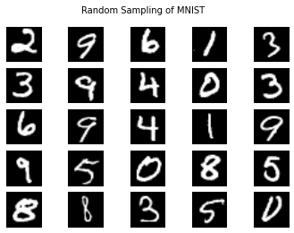
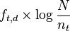

In this chapter, we'll use the KeystoneML framework to build an image classifier and a text classifier.

Before getting to the details of the classification tasks, let's quickly review
the goals of the project and the underlying principles of the framework.

##KeystoneML

KeystoneML is a software framework designed to make building and deploying large scale machine learning pipelines easier.
To assist developers in this task we have created an API that simplifies common tasks and presents a unified interface
for all stages of the pipeline.

Additionally we've included a rich library of example pipelines and the operators (or *nodes*) that support them. We've also provided a number of utilities that are useful for things like loading training data and computing the classification error of a trained pipeline. The "complete" KeystoneML documentation and codebase can be found at [keystone-ml.org](http://keystone-ml.org/index.html).

##Setup

We've packaged KeystoneML specially for these exercises, so that you can use it interactively from the Spark Shell.

Change directories to your USB root and navigate to the directory "keystoneml". You should find the following items in the directory:
<ul>
<li><code>ampcamp-keystoneml.jar</code>: A specially packaged KeystoneML jar for these exercises</li>
<li><code>20news-bydate</code>: Directory containing "20news-bydate-test" and "20news-bydate-train" as subdirectories.</li>
<li><code>mnist</code>: Directory containing "test-mnist-dense-with-labels.data" and "train-mnist-dense-with-labels.data".</li>
</ul>

Now, you can launch your Spark Shell using KeystoneML as follows from the `keystoneml` subdirectory of the USB directory:

<pre class="prettyprint lang-bsh">
usb/$ cd keystoneml
keystoneml/$ ../spark/bin/spark-shell --master local[4] --jars ampcamp-keystoneml.jar --driver-memory 2G --driver-class-path ampcamp-keystoneml.jar
</pre>

Once your Spark Shell is launched, we begin exploring the KeystoneML API.

##The KeystoneML API
KeystoneML is built on several design principles: supporting end-to-end workflows, type safety, horizontal scalability, and composibility.

By focusing on these principles, KeystoneML allows for the construction of complete, robust, large scale pipelines that are constructed from *reusable, understandable parts*.

At the center of KeystoneML are a handful of core API concepts that allow us to build complex machine learning pipelines out of simple parts: `pipelines`, `nodes`, `transformers`, and `estimators`.

### Pipelines
A `Pipeline` is a dataflow that takes some input data and maps it to some output data through a series of `nodes`. 
By design, these nodes can operate on one data item (for point lookup) or many data items: for batch model evaluation.

In a sense, a pipeline is just a function that is composed of simpler functions. Here's part of the `Pipeline` definition:

~~~
package workflow

trait Pipeline[A, B] {
  // ...
  def apply(in: A): B
  def apply(in: RDD[A]): RDD[B]
  // ...
}
~~~

From this we can see that a Pipeline has two type parameters: its input and output types.
We can also see that it has methods to operate on just a single input data item, or on a batch RDD of data items.

### Nodes
Nodes come in two flavors: `Transformers` and `Estimators`. 
`Transformers` are nodes which provide a unary function interface for both single items and `RDD` of the same type of item, while an `Estimator` produces a `Transformer` based on some training data.

#### Transformers
As already mentioned, a `Transformer` is the simplest type of node, and takes an input, and deterministically *transforms* it into an output. 
Here's an abridged definition of the `Transformer` class.

~~~
package workflow

abstract class Transformer[A, B : ClassTag] extends Pipeline[A, B] {
  def apply(in: A): B
  def apply(in: RDD[A]): RDD[B] = in.map(apply)
  //...
}
~~~

There are a few things going on in this class definition.
First, a Transformer has two type parameters: its input and output types.
Next, it extends Pipeline because every Transformer can be treated as a full pipeline in it's own right.
It also has an `apply` method for a single item transformation which needs to be filled out by the implementor.
Finally, it provides a default implementation of `apply(in: RDD[A]): RDD[B]` which simply runs the single-item version on each item in an RDD.
Developers worried about performance of their transformers on bulk datasets are welcome to override this method, and we do so in KeystoneML with some frequency.

While transformers are unary functions, they themselves may be parameterized by more than just their input. 
To handle this case, transformers can take additional state as constructor parameters. Let's define a simple transformer in the Spark Shell which will add a fixed vector from any vector it is fed as input. *(Note: we make use of [breeze](https://github.com/scalanlp/breeze) library for all local linear algebra operations.)*

~~~
import workflow.Transformer
import breeze.linalg.Vector

class Adder(vec: Vector[Double]) extends Transformer[Vector[Double], Vector[Double]] {
  def apply(in: Vector[Double]): Vector[Double] = in + vec
}
~~~

We can then create a new `Adder` and `apply` it to a `Vector` or `RDD[Vector]` as shown below:

~~~
val vec = Vector(1.0, 2.0, 3.0)

val adder = new Adder(vec)

val res = adder(Vector(2.0, 3.0, 6.0)) 
~~~

What do you expect the value of `res` to be?

Vector(3.0, 5.0, 9.0)

#### Estimators

`Estimators` are what puts the **ML** in KeystoneML.
An abridged `Estimator` interface looks like this:

~~~
package workflow

abstract class Estimator[A, B] {
  protected def fit(data: RDD[A]): Transformer[A, B]
  // ...
}
~~~

That is, an `Estimator` takes in training data as an `RDD` to its `fit()` method, and outputs a Transformer. 
This may sound like abstract functional programming nonsense, but as we'll see this idea is pretty powerful. 

Let's consider a concrete example.
Suppose you have a big list of vectors and you want to subtract off the mean of each coordinate across all the vectors (and new ones that come from the same distribution).
You could define an `Estimator` subclass in your Spark Shell to do this like so:

~~~
import workflow.Estimator
import org.apache.spark.rdd.RDD

class ScalingEstimator extends Estimator[Vector[Double], Vector[Double]] {
  def fit(data: RDD[Vector[Double]]): Adder = {
    val mean = data.reduce(_ + _)/data.count.toDouble    
    new Adder(-1.0 * mean)
  }
}
~~~

A couple things to notice about this example:

1. `fit` takes an RDD, and computes the mean of each coordinate using familiar Spark and breeze operations.
2. Adder satisfies the `Transformer[Vector[Double],Vector[Double]]` interface so we can return an adder from our `ScalerEstimator` estimator.
3. By multiplying the mean by `-1.0` we can reuse the `Adder` code we already wrote and it will work as expected.

We can apply this estimator as shown below:

~~~
val rdd = sc.parallelize(Seq(
  Vector(1.0, 0.0), 
  Vector(0.0, 1.0), 
  Vector(2.0, -4.0)
))

val scalingEstimator = new ScalingEstimator
val meanSubtractor = scalingEstimator.fit(rdd)
val res = meanSubtractor(Vector(2.0, -4.0))
~~~

What do you expect the value of `res` to be?

Vector(1.0, -3.0)

Of course, KeystoneML already includes this functionality out of the box via the `StandardScaler` class, so you don't have to write it yourself!

In most cases, `Estimators` are things that estimate machine learning models - like a `LinearMapEstimator` which learns a standard linear model on training data.

### Chaining Nodes and Building Pipelines

Pipelines are created by chaining transformers and estimators with the `andThen` methods. Going back to a different part of the `Pipeline` interface: 

~~~
package workflow

trait Pipeline[A, B] {
  //...
  final def andThen[C](next: Pipeline[B, C]): Pipeline[A, C] = //...
  final def andThen[C](est: Estimator[B, C], data: RDD[A]): Pipeline[A, C] = //...
  final def andThen[C, L](est: LabelEstimator[B, C, L], data: RDD[A], labels: RDD[L]): Pipeline[A, C] = //...
}
~~~

Ignoring the implementation, `andThen` allows you to take a pipeline and add another onto it, yielding a new `Pipeline[A,C]` which works by first applying the first pipeline (`A` => `B`) and then applying the `next` pipeline (`B` => `C`). 

This is where **type safety** comes in to ensure robustness. As your pipelines get more complicated, you may end up trying to chain together nodes that are incompatible, but the compiler won't let you. This is powerful, because it means that if your pipeline compiles, it is more likely to work when you go to run it at scale. Here's an example of building a simple two stage pipeline and applying it to a vector:

~~~
val pipeline = new Adder(Vector(1.0, 2.0, 3.0)) andThen new Adder(Vector(3.0, 2.0, 1.0))

val res = pipeline(Vector(2.1, -0.3, 7.8))
~~~

What do you think this pipeline does?

This pipeline adds 4.0 to every coordinate of a 3-dimensional vector.

You can *also* chain `Estimators` onto transformers via the `andThen (estimator, data)` or `andThen (labelEstimator, data, labels)` methods. The latter makes sense if you're training a supervised learning model which needs ground truth training labels.

In a moment, we'll see how these simple ideas let us perform complicated
machine learning tasks on distributed datasets.

##Data Sets

First, we'll be classifying text postings from the [20 Newsgroups](http://qwone.com/~jason/20Newsgroups/) dataset. The "bydate" version of the 20 Newsgroups dataset that we'll be using contains 18846 documents in 20 classes, split into 60% training data and 40% test data.

An example document from the `misc.forsale` class looks as follows:

~~~
From: thouchin@cs.umr.edu (T. J. Houchin)
Subject: FOR SALE: FARENHEIT 1280 24bit
Article-I.D.: umr.1993Apr5.231308.3558
Distribution: usa
Organization: University of Missouri - Rolla
Lines: 12
Nntp-Posting-Host: mcs213c.cs.umr.edu
Originator: thouchin@mcs213c.cs.umr.edu

FOR SALE:
  Orchid Fareheit 1280 24bit color card
  -1 meg 
  -almost new
  
$200 or best offer

This is a post for a friend

Call him (Thuan Pho) at 314-368-3624

T.J. Houchin
~~~

These documents are stored in a separate plain-text file each, with each document stored in the folder corresponding to its label.

After that, we'll be classifying images from the [MNIST](http://yann.lecun.com/exdb/mnist/) digit database.

The MNIST database is a dataset of 60,000 handwritten digits in 10 classes, one for each digit. Roughly 50,000 of them are in the training set, and 10,000 in the test set. The MNIST images are 28 by 28 grayscale pixels each, and look as follows:

  
  <!-- Images are downsized intentionally to improve quality on retina displays -->

We have stored the MNIST digits as flattened 1D vectors in a CSV file as follows:

~~~
<label>, <pixel 1>, ... , <pixel 784>
...
<label>, <pixel 1>, ... , <pixel 784>
~~~

We've provided utilities to load these datasets into a form usable by KeystoneML. The techniques we'll work use to classify them are designed to scale well to millions of training examples.

##Linear Classification

There are lots of different classification models out there - SVMs, Naive
Bayes, Decision Trees, Neural Networks.
[MLlib](http://spark.apache.org/mllib) supports many of them. But today, we're
going to focus on *one* model family - specifically Linear Classification, and instead see how proper *featurization* affects this choice of model.

Linear classifiers are the bread-and-butter of machine learning models. If
you've heard of linear regression - the concept of linear classification should
be pretty easy to understand. 

  
  <!-- Images are downsized intentionally to improve quality on retina displays -->

Mathematically, we set up our "features" as a data matrix, `A`, of size (n x d)
where n is the number of training examples and d, the number of features from
some featurizer. The training labels, `b` are then a data matrix of size (n x
k) where each element is either `-1.0` if the training example belongs to a
particular class, or `+1.0` otherwise. A linear classifier learns a model, `x`,
of size (d x k) which minimizes the squared loss `|(Ax - b)^2|`. To control
overfitting we'll use a technique called regularization which adds a penalty
for models that aren't sparse.

There are several ways to solve linear models - including approximate methods
(e.g. gradient descent, coordinate descent) and exact methods (e.g. the normal
equations or QR decomposition).

As part of the KeystoneML project, we've developed several distributed solvers
for linear systems like this. For you - this means that you don't have to worry
about the details of how each of these work, and you can just call one to estimate
your model. We'll see how this works in a little bit.

##Newsgroups Text Classification

We'll begin with a simple KeystoneML pipeline to classify the Newsgroups data set, and then gradually improve it.

###A Simple Pipeline

You can build, train, and evaluate a simple [bag of words](https://en.wikipedia.org/wiki/Bag-of-words_model) text pipeline on the 20 newsgroups dataset by executing the following code in your Spark Shell:

~~~
import ampcamp._
import nodes.learning._
import nodes.nlp._
import nodes.stats._
import nodes.util._

val (trainData, trainLabels) = loadNewsgroupsData(sc, "20news-bydate/20news-bydate-train")

val pipeline = {
  Tokenizer("[\\s]+") andThen
  TermFrequency(x => 1) andThen
  (CommonSparseFeatures(100000), trainData) andThen
  (LogisticRegressionEstimator(newsgroupsClasses.length, regParam = 0, numIters = 10), trainData, trainLabels)
}

evalNewsgroupsPipeline(pipeline, sc, "20news-bydate/20news-bydate-test")

~~~

After all the imports, the first thing this code does is use an ampcamp utility method we have provided to load the Newsgroups training data into an `RDD[String]` for the training documents and an `RDD[Int]` for the class labels. Next, a very simple pipeline for text classification is built using KeystoneML. This pipeline consists of: 

1. `Tokenizer("[\\s]+")`: Simple tokenization (splitting text on whitespace)
2. `TermFrequency(x => 1)`: Attaches the value '1' to tokens that occur in the document
3. `CommonSparseFeatures(100000)`: Converting the tokens to a a sparse feature vector, with the attached values becoming the feature values for the tokens (Keeping only the 100000 tokens that appear in the most training documents)
4. `LogisticRegressionEstimator(newsgroupsClasses.length, regParam = 0, numIters = 10)`: Classification using a Logistic Regression Model, a [generalization](https://en.wikipedia.org/wiki/Generalized_linear_model) of the linear classifier we described above. 

Once the pipeline is built, the final line both trains the pipeline, and evaluates it on the test data.

When the evaluation is finished, it will print a contingency table showing what the trained pipeline classified as what, along with the total classification accuracy:

Total Accuracy: 0.640

Take a look at the largest non-diagonal values in the contingency table. Do these misclassifications make sense to you?

###A Better Pipeline
Let's take the above pipeline and make a very simple change to lower-case the documents before we tokenize them. This may improve classification by grouping together tokens that have the same meaning while lowering the total feature noise the classifier has to deal with. We can do this by adding a `LowerCase` node to the start of the previous pipeline:

~~~
val pipeline = {
  LowerCase() andThen
  Tokenizer("[\\s]+") andThen
  TermFrequency(x => 1) andThen
  (CommonSparseFeatures(100000), trainData) andThen
  (LogisticRegressionEstimator(newsgroupsClasses.length, regParam = 0, numIters = 10), trainData, trainLabels)
}

evalNewsgroupsPipeline(pipeline, sc, "20news-bydate/20news-bydate-test")

~~~

How big of a difference do you expect this to make?

Total Accuracy: 0.644

As we can see, this made a very tiny improvement, but to significantly improve the pipeline we'll need to make a more drastic change.

###An Even Better Pipeline

One such change is using a better term weighting scheme than just 1 if a term occurs in a document and 0 if it doesn't. A popular weighting scheme for bag-of-words models is [tf-idf](https://en.wikipedia.org/wiki/Tf–idf). We will use the following formulation of tf-idf:

  
  <!-- Images are downsized intentionally to improve quality on retina displays -->

<i>ft,d</i> is the number of times term *t* appears in document *d*, *N* is the number of documents in the training corpus, and <i>nt</i> is the number of documents in the training corpus that contain term *t*.

Introducing tf-idf term weighting to the earlier pipeline can be done with the following code:

~~~
val numExamples = trainData.count

val pipeline = {
  LowerCase() andThen
  Tokenizer("[\\s]+") andThen
  TermFrequency(x => x) andThen
  (IDFCommonSparseFeatures(x => math.log(numExamples/x), 100000), trainData) andThen
  (LogisticRegressionEstimator(newsgroupsClasses.length, regParam = 0, numIters = 10), trainData, trainLabels)
}

evalNewsgroupsPipeline(pipeline, sc, "20news-bydate/20news-bydate-test")

~~~

How big of an impact do you think this term reweighting will have?

Total Accuracy: 0.807

We have now reached over 80% accuracy, suggesting that this pipeline is effective for classifying text from the Newsgroups data set.

Feel free to test it out on some sample sentences:

~~~
// Should return "rec.sport.baseball"
newsgroupsClasses(pipeline("The Giants last won the world series in 2014."))

// Should return "sci.space"
newsgroupsClasses(pipeline("Will humans ever colonize Mars?"))
~~~

##MNIST Image Classification

We'll now build a simple KeystoneML pipeline to classify handwritten digits from the MNIST dataset, and then gradually improve it.

###A Simple Pipeline

The following is an absolute baseline MNIST classification pipeline that feeds the raw pixel values into a Linear Classifier:

~~~
import ampcamp._
import nodes.learning._
import nodes.stats._
import nodes.util._
import breeze.linalg.DenseVector
import workflow._

val (trainData, trainLabels) = loadMnistData(sc, "mnist/train-mnist-dense-with-labels.data")

val pipeline = {
  Identity() andThen
  (LinearMapEstimator(lambda = Some(1.0)), trainData, trainLabels) andThen
  MaxClassifier
}

evalMnistPipeline(pipeline, sc, "mnist/test-mnist-dense-with-labels.data")

~~~

This code uses an ampcamp utility method to load the MNIST training data as flattened 784-dimensional (28 x 28) feature vectors into an `RDD[DenseVector[Double]]`, and the class labels are loaded into an `RDD[Int]`. Next, a very simple pipeline is built using KeystoneML that feeds these `DenseVectors` into a Linear Classifier directly, with no feature transformation. Finally, an ampcamp utility method is used to evaluate the MNIST pipeline on test data.

Total Accuracy: 0.860

As you can see, the MNIST digit data set is simple enough that even feeding raw pixel values directly into a simple Linear Classifier is enough to be an effective classifier. We will next show that we can make this classifier even better. 

###A Better Pipeline
Next we will try some techniques known as [Kernel Methods](https://en.wikipedia.org/wiki/Kernel_method). Kernel Methods allow learning classification boundaries that aren't just planes through the data by transforming the feature space into one where the classes are linearly separable, as shown below:

  
  <!-- Images are downsized intentionally to improve quality on retina displays -->

Kernel Methods often do a better job than linear models in practice, but conventional techniques for fitting them don't scale well. More recent techniques known as Scalable Kernel Machines scale much better, and we can actually implement these methods as pipelines in KeystoneML, as shown below:

~~~
val mnistImageSize = 784

val pipeline = {
  RandomSignNode(mnistImageSize) andThen
  PaddedFFT() andThen
  LinearRectifier(0.0) andThen
  (LinearMapEstimator(lambda = Some(1.0)), trainData, trainLabels) andThen
  MaxClassifier
}

evalMnistPipeline(pipeline, sc, "mnist/test-mnist-dense-with-labels.data")

~~~

What this pipeline does is take the raw pixel values, flip the signs of pixels randomly selected at the start, pass the whole thing through an FFT filter, set all values less than 0 to 0, and then send this into a Linear Classifier.

Total Accuracy: 0.919

As we can see, this technique has improved our classification accuracy noticeably.

###An Even Better Pipeline
It just so happens that we can keep adding more of the random features shown above using the following Pipeline:

~~~
val pipeline = {
  Pipeline.gather {
    Seq.fill(8) {
      RandomSignNode(mnistImageSize) andThen
      PaddedFFT() andThen
      LinearRectifier(0.0)
    }
  } andThen
  VectorCombiner() andThen
  (LinearMapEstimator(lambda = Some(1.0)), trainData, trainLabels) andThen
  MaxClassifier
}

evalMnistPipeline(pipeline, sc, "mnist/test-mnist-dense-with-labels.data")

~~~

`Pipeline.gather { ... } andThen VectorCombiner()` is syntax we haven't shown before to build a pipeline which applies the sequence of nested pipelines found in the inner braces in parallel, and then join the outputs into a single vector. Let's run this pipeline in the Spark Shell to see how much impact adding extra features to our classifier can have:

Total Accuracy: 0.970

As you can see, we have significantly improved the classification accuracy by adding more random features. While this is the limit of how many features the `LinearMapEstimator` solver can handle without running out of memory, we have provided other solvers with KeystoneML that can scale to larger feature spaces, and get even better classification accuracy than this on MNIST. 

##Concluding Remarks

You've now built and evaluated several pipelines for text and image classification using KeystoneML. We hope we've convinced you that this is a framework that's easy to use and general purpose enough to capture your machine learning workflow. The KeystoneML project is still a work in progress, so we're happy to receive feedback now that you've used it.
