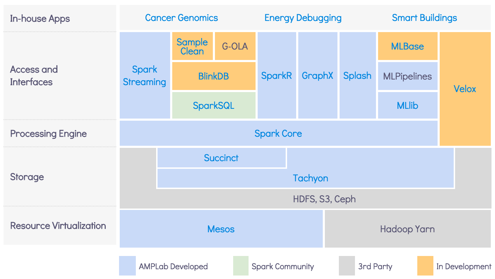

# Welcome
Welcome to the AMP Camp 6 hands-on exercises! These exercises are extended and enhanced from those
given at previous <a href="http://ampcamp.berkeley.edu">AMP Camp Big Data Bootcamps</a>. They were
written by volunteer graduate students and postdocs in the
<a href="https://amplab.cs.berkeley.edu/">UC Berkeley AMPLab</a>. Many of those same graduate
students are present today as teaching assistants. The exercises we cover today will have you
working directly with the Spark specific components of the AMPLab's open-source software stack,
called the <a href="https://amplab.cs.berkeley.edu/software/">Berkeley Data Analytics Stack
(BDAS)</a>.

<!-- 

 -->
These hands-on exercises will have you walk through examples of how to use
<a href="http://spark.apache.org/">Spark</a>, 
<a href="http://tachyon-project.org/">Tachyon</a>, 
and related projects.

# Prerequisites

## Assumptions
In order to get the most out of this course, we assume:

 * You have experience programming in Python or Scala
 * You have a laptop
 * Your laptop has Java 7 or 8 installed

If you would like a quick primer on Scala, check out the following doc in the appendix:

 * [Introduction to the Scala Shell](introduction-to-the-scala-shell.html)

# Exercises Overview

## Languages Used
<table class="bordered" id="langs-table">
<thead>
<tr>
  <th>Section</th>
    <th></th>
    <th></th>
    <th>
  </th>
</tr>
</thead><tbody>
<tr>
  <td>Spark</td>
  <td class="yes">yes</td>
  <td class="no">no</td>
  <td class="yes">yes</td>
</tr><tr>
  <td>Spark SQL</td>
  <td class="yes">yes</td>
  <td class="no">no</td>
  <td class="yes">yes</td>
</tr><tr>
  <td>IndexedRDD</td>
  <td class="yes">yes</td>
  <td class="no">no</td>
  <td class="no">no</td>
</tr><tr>
  <td>Tachyon</td>
  <td class="yes">yes</td>
  <td class="yes">yes</td>
  <td class="no">no</td>
</tr><tr>
  <td>SparkR</td>
  <td class="no">R only</td>
  <td class="no">R only</td>
  <td class="no">R only</td>
</tr><tr>
  <td>Succinct</td>
  <td class="yes">yes</td>
  <td class="no">no</td>
  <td class="no">no</td>
</tr><tr>
  <td>KeystoneML</td>
  <td class="yes">yes</td>
  <td class="no">no</td>
  <td class="no">no</td>
</tr><tr>
  <td>Splash</td>
  <td class="yes">yes</td>
  <td class="no">no</td>
  <td class="no">no</td>
</tr><tr>
  <td>Spark Time Series</td>
  <td class="yes">yes</td>
  <td class="no">no</td>
  <td class="no">no</td>
</tr>
</tbody>
</table>

In several of the proceeding training modules, you can choose which language
you want to use as you follow along and gain experience with the tools.
The following table shows which languages this mini course supports for each section.
You are welcome to mix and match languages depending on your preferences and interests.

## Exercise Content

The modules we will cover at the AMPCamp training are listed below.
These can be done _**in any order**_ according to your interests, though we recommend that new users start with Spark.

Note: Please follow the setup instructions at the [Getting Started](getting-started.html) page before any of the exercises.

### Day 1

{:.bordered}
| Exercise                                                         | Description                                             | Length   | More Documentation                                                                                                |
| ---------------------------------------------------              | ------------------------------------------------------- | :------: | :------------------------------------------------------------------------------:                                  |
| [Spark](data-exploration-using-spark.html)                       | Use the Spark shell to write interactive queries        | Short    | [Programming Guide](http://spark.apache.org/docs/latest/programming-guide.html)                                   |
| [Spark SQL](data-exploration-using-spark-sql.html)               | Use the Spark shell to write interactive SQL queries    | Short    | [Programming Guide](http://spark.apache.org/docs/latest/sql-programming-guide.html)                               |
| [IndexedRDD](indexedrdd.html)                                    | Use mutable RDDs                                        | Medium   | [Github](https://github.com/amplab/spark-indexedrdd)                                                              |
| [Tachyon](tachyon.html)                                          | Deploy Tachyon and try simple functionalities.          | Medium   | [Project Website](http://tachyon-project.org/)                                                                    |
| [SparkR](sparkr.html)                                            | Interactive Data Analytics using Spark in R             | Short    | [Programming Guide](http://spark.apache.org/docs/latest/sparkr.html)                                              |

### Day 2

{:.bordered}
| Exercise                                                         | Description                                             | Length   | More Documentation                                                                                                |
| ---------------------------------------------------              | ------------------------------------------------------- | :------: | :------------------------------------------------------------------------------:                                  |
| [Succinct](succinct.html)                                        | Query compressed data with Succinct                     | Medium   | [Project Page](http://succinct.cs.berkeley.edu)                                                                          |
| [KeystoneML](image-classification-with-pipelines.html)           | Text and Image classification with KeystoneML           | Medium   | [Project Page](http://keystone-ml.org/)                                                                           |
| [Splash](splash.html)                                            | Use Splash to run stochastic learning algorithms        | Short    | [Project Page](http://zhangyuc.github.io/splash/)                                                                 | 
| [Spark Time Series](time-series-tutorial-AR.html)                | Analyze time series data                                | Long     |                                                                                                                   |

## IRC Chat Room
A chat room is available for participants to connect with each other and get realtime help with exercises.
The room can be joined <a href="http://webchat.freenode.net/?randomnick=1&channels=%23ampcamp&prompt=1">here</a>
or by using an IRC client to connect to the #ampcamp channel on the FreeNode
(irc.freenode.net) network.
