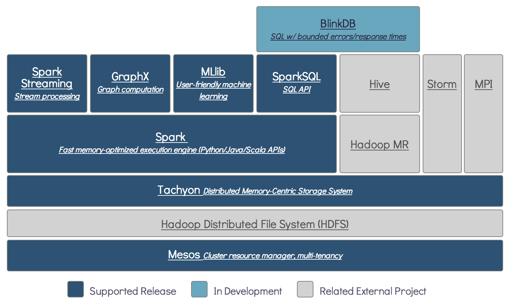

# Welcome
Welcome to the AMP Camp 5 hands-on exercises! These exercises are extended and enhanced from those
given at previous <a href="http://ampcamp.berkeley.edu">AMP Camp Big Data Bootcamps</a>. They were
written by volunteer graduate students and postdocs in the
<a href="https://amplab.cs.berkeley.edu/">UC Berkeley AMPLab</a>. Many of those same graduate
students are present today as teaching assistants. The exercises we cover today will have you
working directly with the Spark specific components of the AMPLab's open-source software stack,
called the <a href="https://amplab.cs.berkeley.edu/software/">Berkeley Data Analytics Stack
(BDAS)</a>.

<!-- 

 -->
These hands-on exercises will have you walk through examples of how to use
<a href="http://tachyon-project.org/">Tachyon</a>, 
<a href="http://spark.apache.org/">Spark</a>, and related projects.

# Prerequisites

## Assumptions
In order to get the most out of this course, we assume:

 * You have experience using the core Spark APIs
 * You have a laptop
 * Your laptop has Java 6 or 7 installed

If you would like a quick primer on Scala, check out the following doc in the appendix:

 * [Introduction to the Scala Shell](introduction-to-the-scala-shell.html)

# Exercises Overview

## Languages Used
<table class="bordered" id="langs-table">
<thead>
<tr>
  <th>Section</th>
    <th></th>
    <th></th>
    <th>
  </th>
</tr>
</thead><tbody>
<tr>
  <td>Spark</td>
  <td class="yes">yes</td>
  <td class="no">no</td>
  <td class="yes">yes</td>
</tr><tr>
  <td>Spark SQL</td>
  <td class="yes">yes</td>
  <td class="no">no</td>
  <td class="yes">yes</td>
</tr><tr>
  <td>Tachyon</td>
  <td class="no">no</td>
  <td class="yes">yes</td>
  <td class="no">no</td>
</tr>
<!--
</tr><tr>
  <td>Spark Streaming</td>
  <td class="yes">yes</td>
  <td class="yes">yes</td>
  <td class="no">no</td>
  -->
</tr><tr>
  <td>MLlib</td>
  <td class="yes">yes</td>
  <td class="no">no</td>
  <td class="yes">yes</td>
</tr><tr>
  <td>GraphX</td>
  <td class="yes">yes</td>
  <td class="no">no</td>
  <td class="no">no</td>
</tr><tr>
  <td>Pipelines</td>
  <td class="no">no</td>
  <td class="yes">yes</td>
  <td class="no">no</td>
</tr><tr>
  <td>SparkR</td>
  <td class="yes">R only</td>
  <td class="yes">R only</td>
  <td class="yes">R only</td>
</tr><tr>
  <td>ADAM</td>
  <td class="no">no</td>
  <td class="yes">yes</td>
  <td class="no">no</td>
</tr>
</tbody>
</table>

In several of the proceeding training modules, you can choose which language
you want to use as you follow along and gain experience with the tools.
The following table shows which languages this mini course supports for each section.
You are welcome to mix and match languages depending on your preferences and interests.

## Exercise Content

The modules we will cover at the AMPCamp training are listed below.
These can be done _**in any order**_ according to your interests, though we recommend that new users start with Spark.

### Day 1

{:.bordered}
| Exercise                                                         | Description                                             | Length   | More Documentation                                                                                                |
| ---------------------------------------------------              | ------------------------------------------------------- | :------: | :------------------------------------------------------------------------------:                                  |
| [Spark](data-exploration-using-spark.html)                       | Use the Spark shell to write interactive queries        | Short    | [Programming Guide](http://spark.apache.org/docs/latest/sql-programming-guide.html)                               |
| [Spark SQL](data-exploration-using-spark-sql.html)               | Use the Spark shell to write interactive SQL queries    | Short    | [Programming Guide](http://spark.apache.org/docs/latest/sql-programming-guide.html)                               |
| [Tachyon](tachyon.html)                                          | Deploy Tachyon and try simple functionalities.          | Medium   | [Project Website](http://tachyon-project.org/)                               |
| [MLlib](movie-recommendation-with-mllib.html)                    | Build a movie recommender with Spark                    | Medium   | [Programming Guide](http://spark.apache.org/docs/latest/mllib-guide.html)                                         |
| [GraphX](graph-analytics-with-graphx.html)                       | Explore graph-structured data and graph algorithms      | Long     | [Programming Guide](http://spark.apache.org/docs/latest/sql-programming-guide.html)                               |

<!--
### Day 2

{:.bordered}
| Exercise                                                         | Description                                             | Length   | More Documentation                                                                                                |
| ---------------------------------------------------              | ------------------------------------------------------- | :------: | :------------------------------------------------------------------------------:                                  |
| [Pipelines](image-classification-with-pipelines.html)            | Image classification with pipelines                     | Medium   | |
| [SparkR](sparkr.html)                                            | Interactive Data Analytics using Spark in R             | Short    | [Project Page](http://amplab-extras.github.io/SparkR-pkg/); [Github](https://github.com/amplab-extras/SparkR-pkg) |
| [ADAM](genome-analysis-with-adam.html)                           | Genome analysis with ADAM                               | Medium   | |
-->
