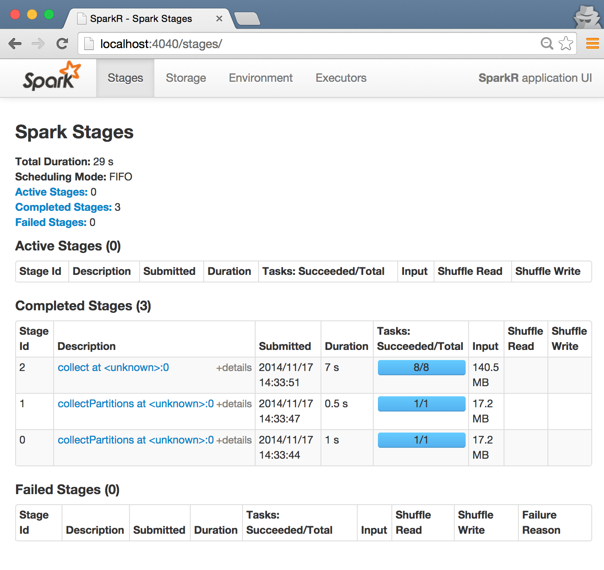

#### TODOs & FIXMEs
- Dry runs.
- Installation process.
- Add a table of contents like the [GraphX exercise](graph-analytics-with-graphx.html).
- Add instruction for RStudio?

## Prerequisite: getting the dataset
<pre class="prettyprint lang-bsh">
# first, cd into the root directory of the USB drive
$ mkdir data/tsv_wiki && cd data/tsv_wiki
# download the data (49MB compressed; 140MB uncompressed) from the following URL
$ wget -c http://cs.berkeley.edu/~shivaram/ampcamp-data/tsv_wiki.zip
# unzip the archive
$ unzip tsv_wiki.zip
# you're good to go!
</pre>

In this chapter, we will use the SparkR shell to interactively explore the Wikipedia data.

## Interactive Analysis

Let's now use Spark to do some order statistics on the data set.
First, launch the Spark shell:

<pre class="lang-bash">
SPARK_MEM=1g MASTER="local[4]" SparkR/sparkR
</pre>

The prompt should appear within a few seconds. __Note:__ You may need to hit `[Enter]` once to clear the log output.

1. Warm up by creating an RDD (Resilient Distributed Dataset) named `data` from the input files.
   In the Spark shell, the SparkContext is already created for you as variable `sc`.

     <pre class="prettyprint lang-r">
> sc
[1] "Java-Object{org.apache.spark.api.java.JavaSparkContext@7a856d3b}" 
> data <- textFile(sc, "data/tsv_wiki")
> data
An object of class "RDD"
Slot "env":
<environment: 0x7fae86040838>
Slot "jrdd":
[1] "Java-Object{data/tsv_wiki MappedRDD[1] at textFile at <unknown>:0}"</pre>

2. Let's take a peek at the data. You can use the take operation of an RDD to get the first K records. Here, K = 2.

     <pre class="prettyprint lang-r">> take(data, 2)
...</pre>

    You should see that a list of two strings is printed out. Each element is a
    character vector (string) containing the content of a Wikipedia page, as you can inspect like so:

     <pre class="prettyprint lang-r">> typeof(take(data, 2)[[1]])
[1] "character"</pre>

2. Let's see how many records in total are in this data set (this command will take a while, so read ahead while it is running).

     <pre class="prettyprint lang-r">
> count(data)</pre>

   This should take about 10-20 seconds.

   This should launch 3 Spark tasks on the Spark cluster.
   While it's running, you can open the Spark web console to see the progress.
   To do this, open your favorite browser, and type in the following URL.

   `http://localhost:4040`

   Note that this page is only available if you have an active job or Spark shell.  

   

   The links in this interface allow you to track the job's progress and
   various metrics about its execution, including task durations and cache
   statistics.

   When your query finishes running, it should return the following count:

       [1] 7967

4. Recall from the [SparkSQL exercise](data-exploration-using-spark-sql.html) that the schema of the data is `(pageId, title, modifiedTime, text, username)`.
   Let's parse our data and create an RDD containing these fields in a list. 
   This can be done using `lapply()` (alias to the familiar `map()`) on the RDD. For each record, we will then split it by the field delimiter (i.e. a tab) using `strsplit()` .

   To avoid reading from disks each time we perform any operations on the RDD, we also __cache the RDD into memory__.

   <pre class="prettyprint lang-r">
    parseFields <- function(record) {
      parts <- strsplit(record, "\t")[[1]]; 
      list(id=parts[1], title=parts[2], modified=parts[3], text=parts[4], username=parts[5])
    }
    parsedRDD <- lapply(data, parseFields)
    cache(parsedRDD)</pre>

   When you type this command into the Spark shell, Spark defines the RDD, but because of lazy evaluation, no computation is done yet.
   Next time any action is invoked on `parsedRDD`, Spark will cache the data set in memory.

5. How many records are there for in `parsedRDD` ?

   <pre class="prettyprint lang-r">> count(parsedRDD)
[1] 7597</pre>

    This should be the same number as before as we have one parsed record per line.

6. Let's try something fancier.
   Generate a histogram of the number of contributions by each user in our dataset.
   The high level idea of what we'll be doing is as follows.
   First we will take just the usernames from our dataset and filter out records which don't have any usernames. 

   <pre class="prettyprint lang-r">
usernames <- lapply(parsedRDD, function(x) { x$username })
nonEmptyUsernames <- Filter(function(x) { !is.na(x) }, usernames)
   </pre>

   Next, we will create a tuple with (username, 1L) and shuffle the data and group all values of the same key together.
   Finally we sum up the values for each key.
   There is a convenient method called `reduceByKey` in Spark for exactly this pattern.
   Note that the second argument to `reduceByKey` determines the number of reducers to use.
   By default, Spark assumes that the reduce function is commutative and associative and applies combiners on the mapper side.
   Lets use 8 reducers in this example as it is the same number of partitions our input RDD had.
   This is usually a good heuristic unless you know the 
   
   <pre class="prettyprint lang-r">
    userContributions <- lapply(nonEmptyUsernames, function(x) { (x, 1L) })
    userCounts <- collect(reduceByKey(userContributions, "+", 8L))</pre>

   Now `userCounts` is a local list and we can explore the data using any available R commands.
   For example we can get the top 10 users by sorting this list and taking the last 10 elements.

   <pre class="prettyprint lang-r">
    top10users <- tail(userCounts[order(unlist(sapply(userCounts, `[`, 2)))], 10)
    top10users</pre>

   We can also plot a histogram of user contributions using R's `hist` command

   <pre class="prettyprint lang-r">
    counts <- unlist(sapply(userCounts, `[`, 2))
    hist(counts)</pre>

7. As an exercise try to answer the following question using the commands from above:
   How many articles contain the word “California”?

   Hint: You can use the R command `grepl` to determine if a word is present in a string

   

   <pre class="prettyprint lang-r">
     calArticles <- Filter(function(item) { grepl("California", item$text) }, parsedRDD)
     count(calArticles)
   </pre>
   

8. You can explore the full RDD API by using the command `help(package=SparkR)`.

