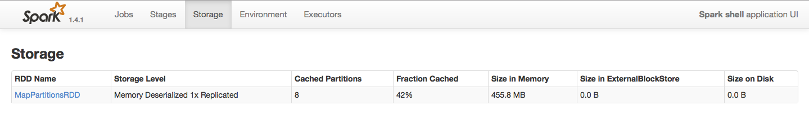
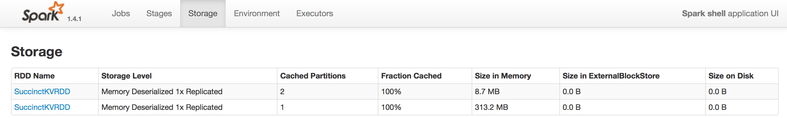

{:toc}

Succinct is a distributed data store that supports a wide range of point 
queries directly on a compressed representation of the input data. We are very
excited to announce the release Succinct Spark, as a Spark package, that enables
search, range and random access queries on compressed RDDs. This release allows 
users to use Apache Spark as a document store (with search on documents) similar 
to ElasticSearch, a key-value interface (with search on values) similar to 
HyperDex, and an experimental DataFrame interface (with search along columns in
a table).

## Creating a Succinct RDD

To start using Succinct's API, we need to start up the Spark Shell with the 
Succinct Spark package jars available to it. The following command directs the Spark
Shell to load the jar for the Succinct Spark package, and increases the executor
memory to 2GB (since we'll be working with large datasets later in the exercise):

<pre class="prettyprint lang-bsh">
usb/$ bin/spark-shell --jars jars/succinct/succinct-0.1.5.jar --executor-memory 2G --conf "spark.driver.extraJavaOptions=-XX:MaxPermSize=256m"
</pre>

Now that we have the Spark shell loaded with the Succinct Spark package, we'll
take a look at how we can query _compressed wikipedia articles_ using Succinct's
key-value API.  Let's start with importing the required classes:

~~~
import edu.berkeley.cs.succinct.kv._
~~~

The Succinct Spark package compresses certain regular RDDs into Succinct RDDs
creates data structures to enable queries on them. In this exercise we will
work with an RDD of `(articleID, article)` pairs, where each entry corresponds
to a single Wikipedia article.

Let's start with loading the Wikipedia articles into a regular RDD. The dataset
provided is stored as a CSV file of `(articleID, article)` pairs. The following
snippet loads the dataset and creates an RDD of key value pairs pairs:

~~~
val wikiData = sc.textFile("data/succinct/wiki-small.txt").map(_.split('|'))
val wikiKV = wikiData.map(entry => (entry(0).toLong, entry(1)))
~~~

Lets take a look at the number of documents we have in the RDD:

~~~
wikiKV.count
~~~

Not too many. 

If we wanted to find all `articleId`s corresponding to `article`s containing the term
"Berkeley", we can use the filter operation as follows:

~~~
val articleIdsRDD = wikiKV.filter(kvPair => kvPair._2.contains("Berkeley")).map(_._1)
articleIdsRDD.count
~~~

We've found only 3 artciles, but note that Spark had to scan through all 250 to 
find them.

Lets take a look at how we can now convert this RDD into a `SuccinctKVRDD`. 
While the keys can be of arbitrary type (`Long` in this example), each array is
an array of bytes. We can transform the RDD we created before as follows:

~~~
val succinctWikiKV = wikiKV.map(t => (t._1, t._2.getBytes)).succinctKV
~~~

Lets make sure we still have all the documents:

~~~
succinctWikiKV.count
~~~

That's it! We now have a _compressed version of the RDD_ that supports a number
of interesting queries directly on the compressed RDD.

## Querying Succinct RDDs

Lets start querying our new compressed RDD. One of the key operations
on compressed RDDs in Succinct is `search(query)` -- similar to the filter 
operation on the uncompressed RDD before, the following query obtains an RDD 
of `articleID`s corresponding to all `article`s containing "Berkeley":

~~~
val articleIdsRDD2 = succinctWikiKV.search("Berkeley")
articleIdsRDD2.count
~~~

As before, we've obtained the 3 articles containing "Berkeley", but 
_without having to scan all 250 articles_. We don't use indexes either,
all the information required to search for any arbitrary term is 
_embedded within the compressed representation_.

The `articleIds` themselves don't reveal much; we need to look at the
article text for them...

SuccinctKVRDD allows you to fetch the value corresponding to any key
through the familiar `get(key)` API. We'll use this API to fetch the
article contents corresponding to each of these `articleIds`: 

~~~
val articleIds = articleIdsRDD2.take(3)
articleIds.foreach(key => {
	val valueBuf = succinctWikiKV.get(key)
	println("articleID = " + key + " article = " + new String(valueBuf))
})
~~~

We've taken a look at how we can compress data on Spark into a SuccinctKVRDD,
and seen how we can execute queries directly on these compressed RDDs. However,
we've only worked with a small dataset size of 250 Wikipedia articles.

## Working with Larger RDDs

In practice, we would want to work with much larger datasets. In order to 
analyze relatively larger datasets, we've pre-processed ~600MB of Wikipedia
articles on your USB drive.

Lets first analyze the dataset using Spark's native RDDs as before; we'll start
by loading the dataset and caching it in memory:

~~~
val wikiKV2 = sc.textFile("data/succinct/wiki-large.txt").map(_.split('|')).map(t => (t(0).toLong, t(1)))
wikiKV2.count
~~~

The dataset contains 300000 articles -- much more than before. We can take a look at the
storage footprint of the RDD at http://localhost:4040/storage/. This is what it should look like:

Depending on the configuration of the machine you're running on, the number of 
partitions or the amount of data cached may vary.

Lets try executing the same search query as before on this dataset, using the 
filter operation:

~~~
val articleIdsRDD3 = wikiKV2.filter(kvPair => kvPair._2.contains("Berkeley")).map(_._1)
articleIdsRDD3.count
~~~

Take a note of how long the query took to execute.

Another important query for document and key-value stores is `get(key)`. We can
emulate this on a Spark RDD using the following snippet:

~~~
val article = wikiKV2.filter(kvPair => kvPair._1 == 0).map(_._2).collect()(0)
~~~

Again, note the time taken to execute this query.

Now lets see how we can perform the same operations on a SuccinctKVRDD. In the 
interest of time, we also preprocessed the larger Wikipedia dataset into 
Succinct data structures and stored it on your USB drive. Before we load the 
Succinct data structures, lets uncache the previous RDD:
 

~~~
wikiKV2.unpersist()
~~~

Now we'll try loading the preprocessed data and running queries on it:

~~~
val succinctWikiKV2 = sc.succinctKV[Long]("data/succinct/succinct-wiki-large")
succinctWikiKV2.count 
~~~

The command above directs Spark to load the `SuccinctKVRDD` with `Long` keys 
from the specified location on disk. We have the same number of articles as 
the uncompressed RDD, but _with a much lower storage footprint_. To see how much
smaller, go back to http://localhost:4040/storage/; it might look something like 
this:

Now we'll try running the same set of queries as before on the SuccinctKVRDD.
Let's start with search:

~~~
val articleIdsRDD4 = succinctWikiKV2.search("Berkeley")
articleIdsRDD4.count
~~~

Note the time taken to execute the query; as we described earlier, Succinct avoids having to _scan_
all 300000 articles to obtain the ones that contain "Bekeley" -- it embeds all necessary information to obtain
the query results directly from the compressed representation. This leads to both _reduced storage overheads_
as well as _low latency_ for search queries.

Let's take a look at few of the matching articles using the `get(key)` operation:

~~~
val articleIds4 = articleIdsRDD4.take(10)
articleIds4.foreach(key => {
	val valueBuf = succinctWikiKV2.get(key)
	println("articleID = " + key + " article = " + new String(valueBuf))
})
~~~

Again, contrast the performance of `get(key)` for SuccinctKVRDD and Spark's 
native RDD -- the benefits arise due to Succinct's native support for 
_random access_ as opposed to performing data scans in regular RDDs.

In addition, SuccinctKVRDD also supports random access _within values_. For instance,
we can extract the first 100 bytes for the `article` with `articleId` 42 as follows:

~~~
val extractedData = new String(succinctWikiKV2.extract(42, 0, 100))
~~~

Our goal with the Succinct project is to push the boundaries of queries that can be executed
directly on compressed data. To this end, we've added support for _regular expression queries_ 
directly on compressed RDDs! The supported operators include union (`R1|R2`), repeat (`R1+`, `R1*`), 
concat (`(R1)(R2)`) and wildcard (`R1.*R2`). The API is quite similar to the `search(query)` before:

~~~
val articleIdsRDD5 = succinctWikiKV2.regexSearch("(stanford|berkeley)\\.edu")
val articleIds5 = articleIdsRDD5.take(10)
articleIds5.foreach(key => {
	val valueBuf = succinctWikiKV2.get(key)
	println("articleID = " + key + " article = " + new String(valueBuf))
})
~~~

And that's it! This brings us to the end of this Succinct chapter of the tutorial. To find out
more about Succinct, we encourage you to visit our [website](http://succinct.cs.berkeley.edu).