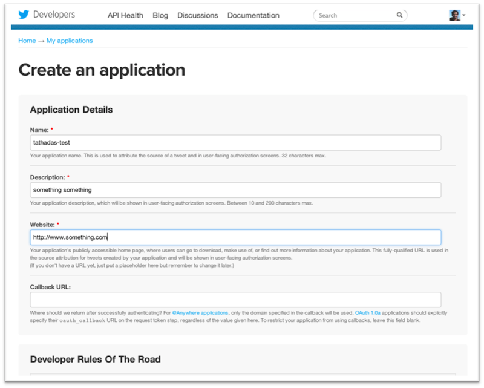
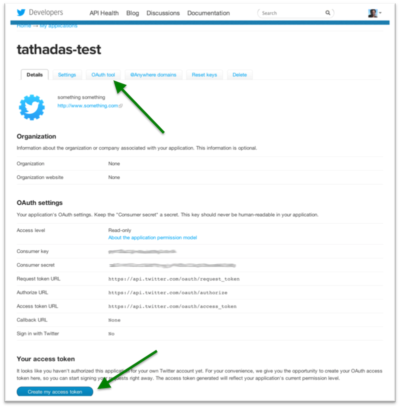
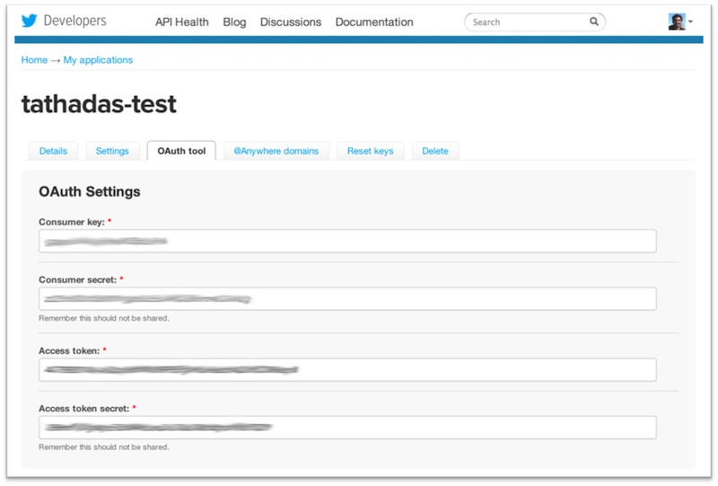
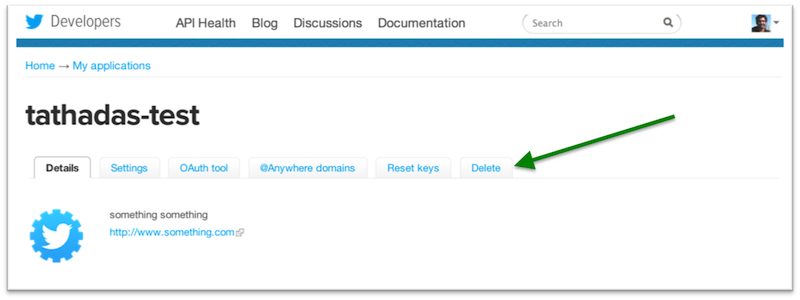

In this chapter, we will walk you through using Spark Streaming to process live data streams. Remember, Spark Streaming is a component of Spark that provides highly scalable, fault-tolerant streaming processing. These exercises are designed as standalone Scala programs which will receive and process Twitter's real sample tweet streams. For the exercises in this section, you can choose to use Scala or Java. If you would like to use Scala but are not familiar with the language, we recommend that you see the [Introduction to the Scala Shell](introduction-to-the-scala-shell.html) section to learn some basics.

## Setup
This section will first introduce you to the basic system setup of the standalong Spark Streaming programs, and then guide you through the steps necessary to create Twitter authentication tokens necessary for processing Twitter's real time sample stream.

### System Setup

We use a modified version of the Scala standalone project template introduced in the [Running Standalone Spark Programs](data-exploration-using-spark.html#running-standalone-spark-programs) section for the next exercise. In your AMI, this has been setup in `/root/streaming/`. You should find the following items in the directory.

<b>What is SBT?</b>

Simple Build Tool, or SBT, is popular open-source a build tool for Scala and Java projects, written in Scala. Currently, Spark can be built using SBT or Maven, while Spark Streaming an Shark can be built with SBT only. Read more about SBT at <a href="https://github.com/harrah/xsbt/wiki" target="_blank">its Github page</a>.

- `twitter.txt:` File containing Twitter authentication details 
- For Scala users
  - `scala/sbt:` Directory containing the SBT tool
  - `scala/build.sbt:` SBT project file
  - `scala/Tutorial.scala:` Main Scala program that you are going to edit, compile and run
  - `scala/TutorialHelper.scala:` Scala file containing few helper functions for `Tutorial.scala`
- For Java users
  - `java/sbt:` Directory containing the SBT tool
  - `java/build.sbt:` SBT project file
  - `java/Tutorial.java` Main Java program that you are going to edit, compile and run
  - `java/TutorialHeler.java:` Java file containing a few helper functions
  - `java/ScalaHelper.java:` Scala file containing a few helper functions

The main file you are going to edit, compile and run for the exercises is `Tutorial.scala` or `Tutorial.java`. It should look as follows:

~~~
import spark._
import spark.streaming._
import StreamingContext._
import TutorialHelper._

object Tutorial {
  def main(args: Array[String]) {

    // Location of the Spark directory
    val sparkHome = "/root/spark"

    // URL of the Spark cluster
    val sparkUrl = getSparkUrl()

    // Location of the required JAR files
    val jarFile = "target/scala-2.9.3/tutorial_2.9.3-0.1-SNAPSHOT.jar"

    // HDFS directory for checkpointing
    val checkpointDir = TutorialHelper.getHdfsUrl() + "/checkpoint/"

    // Configure Twitter credentials using twitter.txt
    TutorialHelper.configureTwitterCredentials()    
    
    // Your code goes here
  }
}
~~~

~~~
import spark.api.java.*;
import spark.api.java.function.*;
import spark.streaming.*;
import spark.streaming.api.java.*;
import twitter4j.*;
import java.util.Arrays;
import scala.Tuple2;

public class Tutorial {
  public static void main(String[] args) throws Exception {
    // Location of the Spark directory
    String sparkHome = "/root/spark";

    // URL of the Spark cluster
    String sparkUrl = TutorialHelper.getSparkUrl();

    // Location of the required JAR files
    String jarFile = "target/scala-2.9.3/tutorial_2.9.3-0.1-SNAPSHOT.jar";

    // HDFS directory for checkpointing
    String checkpointDir = TutorialHelper.getHdfsUrl() + "/checkpoint/";

    // Twitter credentials from login.txt
    TutorialHelper.configureTwitterCredentials()    

    // Your code goes here
  }
}
~~~

For your convenience, we have added a couple of helper function to get the parameters that the exercises need.

- `getSparkUrl()` is a helper function that fetches the Spark cluster URL from the file `/root/spark-ec2/cluster-url`.
- `configureTwitterCredential()` is another helper function that configure Twitter's authentication detail using the file `/root/streaming/twitter.txt`. This is explained further in the next section.

### Twitter Credential Setup

Since all the exercises are based on Twitter's sample tweet stream, configuring OAuth authentication with a Twitter account is necessary. To do this, you will need to setup a consumer key+secret pair and a access token+secret pair using a Twitter account. Please follow the instructions below to setup these temporary access keys with your Twitter account. These instructions will not require you to provide your Twitter username/password. You will only be required to provide the consumer key and access token pairs that you will generate, which you can easily destroy the keys once you have finished the tutorial. So your Twitter account will not be compromised in any way.

1. Open this <a href="https://dev.twitter.com/apps" target="_blank">link</a>. This page lists the set of Twitter-based applications that you own and have already created a consumer keys and access tokens for. If you have never created any application before, then this will obviously be an empty list. For this tutorial, create a new temporary application. To do this, click on the blue button "Create a new application". The new application page should look like as shown below. Provide the required fields. The __Name__ of the application must be globally unique, so using your Twitter username as a prefix to the name should ensure that. For example, set it as [your-twitter-handle]-test. For the __Description__ , anything is fine. For the __Website__ , again any website is fine. But ensure that it is a fully-formed URL with the prefix http:// . Then, click on the "Yes, I agree" checkbox below the __Developer Rules of the Road__ . Finally, fill in the CAPTCHA and click on the blue button saying "Create your Twitter application".

    

2. Once you have created the application, you will be presented with a confirmation page similar to the one shown below. You should be able to see the consumer key and the consumer secret that has been generated. To generate the access token and the access token secret, click on the blue button "Create my access token" at the end of the page (lower green arrow in the figure below). Note that there will be small green confirmation at the top of the page saying that the token has been generated. 

    

3. To get all keys and secrets required for authentical, click on the tab _OAuth Tool_ in the top menu on the page (upper green arrow in the previous figure). You will be presented with a page similar to the one shown below. 

    

4. Finally, update the twitter configuration file using your favorite text editor.

    <pre class="prettyprint lang-bsh">
    cd /root/streaming/
    vim twitter.txt 
    </pre>
    
    You should see the follow template of = separated key-value pairs already setup. 

    <pre class="nocode">
    consumerKey =
    consumerSecret =
    accessToken =
    accessTokenSecret =
    </pre>
    
    Please copy the values from the previous webpage into this appropriate keys in this file. After copying, it should look something like the following.

    <pre class="nocode">
    consumerKey = z25xt02zcaadf12 ...
    consumerSecret = gqc9uAkjla13 ...
    accessToken = 8mitfTqDrgAzasd ...
    accessTokenSecret = 479920148 ...
    </pre>
    
    Please double check that the right values have been assigned to the right key. Save the file and proceed to writing your first Spark Streaming program.
5.  Once you have finished the tutorial, you can go back to the <a href="https://dev.twitter.com/apps" target="_blank">starting page</a> and delete the application you have created. To do this click on the application, and then click on _Delete_ as shown by the arrow below. This will automatically invalidate the tokens.

    

## First Spark Streaming program
Let's try to write a very simple Spark Streaming program that prints a sample of the tweets it receives from Twitter every second. First locate the
`Tutorial` class and open it with a text editor.

<pre class="prettyprint lang-bsh">
cd /root/streaming/scala/
vim Tutorial.scala
</pre>

<pre class="prettyprint lang-bsh">
cd /root/streaming/java/
vim Tutorial.java
</pre>

The cluster machines have both vim and emacs installed for editing. Alternatively, you can use your favorite text editor locally and then copy-paste content using vim or emacs before running it.

To express any Spark Streaming computation, a StreamingContext object needs to be created.
This object serves as the main entry point for all Spark Streaming functionality.

~~~
    val ssc = new StreamingContext(sparkUrl, "Tutorial", Seconds(1), sparkHome, Seq(jarFile))
~~~

~~~
    JavaStreamingContext ssc = new JavaStreamingContext(
      sparkUrl, "Tutorial", new Duration(1000), sparkHome, new String[]{jarFile});
~~~

Here, we create a StreamingContext object by providing the Spark cluster URL, the batch duration we'd like to use for streams, the Spark home directory, and the list of JAR files that are necessary to run the program. "Tutorial" is a unique name given to this application to identify it the Spark's web UI. We elect for a batch duration of 1 second. Next, we use this context to create a stream of tweets:

~~~
    val tweets = ssc.twitterStream()
~~~

~~~
    JavaDStream<Status> tweets = ssc.twitterStream();
~~~

The object `tweets` is a DStream of tweet statuses. More specifically, it is continuous stream of RDDs containing objects of type [twitter4j.Status](http://twitter4j.org/javadoc/twitter4j/Status.html). As a very simple processing step, let's try to print the status text of the some of the tweets.

~~~
    val statuses = tweets.map(status => status.getText())
    statuses.print()
~~~

~~~
    JavaDStream<String> statuses = tweets.map(
      new Function<Status, String>() {
        public String call(Status status) { return status.getText(); }
      }
    );
    statuses.print();
~~~

Similar to RDD transformation in the earlier Spark exercises, the `map` operation on `tweets` maps each Status object to its text to create a new 'transformed' DStream named `statuses`. The `print` output operation tells the context to print first 10 records in each RDD in a DStream, which in this case, are 1 second batches of received status texts.

We also need to set an HDFS for periodic checkpointing of the intermediate data.

~~~
    ssc.checkpoint(checkpointDir)
~~~

~~~
    ssc.checkpoint(checkpointDir);
~~~

Finally, we need to tell the context to start running the computation we have setup.

~~~
    ssc.start()
~~~

~~~
    ssc.start();
~~~

__Note that all DStream operations must be done before calling this statement.__

After saving `Tutorial.scala`, it can be run from the command prompt using the following command (from within the `/root/streaming/[language]` directory).

<pre><code>sbt/sbt package run</code></pre>

This command will automatically compile the `Tutorial` class and create a JAR file in `/root/streaming/[language]/target/scala-2.9.2/`. Finally, it will run the program. You should see output similar to the following on your screen:

<pre class="nocode">
-------------------------------------------
Time: 1359886325000 ms
-------------------------------------------
RT @__PiscesBabyyy: You Dont Wanna Hurt Me But Your Constantly Doing It
@Shu_Inukai ?????????????????????????????????????????
@Condormoda Us vaig descobrir a la @080_bcn_fashion. Molt bona desfilada. Salutacions des de #Manresa
RT @dragon_itou: ?RT???????3000???????????????????????????????????10???????

?????????????????2?3???9???? #???? http://t.co/PwyA5dsI ? h ...
Sini aku antar ke RSJ ya "@NiieSiiRenii: Memang (?? ?`? )"@RiskiMaris: Stresss"@NiieSiiRenii: Sukasuka aku donk:p"@RiskiMaris: Makanya jgn"
@brennn_star lol I would love to come back, you seem pretty cool! I just dont know if I could ever do graveyard again :( It KILLs me
????????????????????????????????????????????????????????????????????????????????????????ww
??????????
When the first boats left the rock with the artificers employed on.
@tgs_nth ????????????????????????????
...

-------------------------------------------
Time: 1359886326000 ms
-------------------------------------------
???????????
???????????
@amatuki007 ????????????????????????????????
?????????????????
RT @BrunoMars: Wooh!
Lo malo es qe no tiene toallitas
Sayang beb RT @enjaaangg Piye ya perasaanmu nyg aku :o
Baz? ?eyler yar??ma ya da reklam konusu olmamal? d???ncesini yenemiyorum.
?????????????MTV???????the HIATUS??
@anisyifaa haha. Cukupla merepek sikit2 :3
@RemyBot ?????????
...
</pre>

To stop the application, use `Ctrl + c` .

__FAQ__: If you see the following message, it means that the authentication with Twitter failed.

<pre class="nocode">
13/02/04 23:41:57 INFO streaming.NetworkInputTracker: De-registered receiver for network stream 0 with message 401:Authentication credentials (https://dev.twitter.com/pages/auth) were missing or incorrect. Ensure that you have set valid consumer key/secret, access token/secret, and the system clock is in sync.
&lt;html&gt;
&lt;head&gt;
&lt;meta http-equiv="Content-Type" content="text/html; charset=utf-8"/&gt;
&lt;title&gt;Error 401 Unauthorized&lt;/title&gt;
&lt;/head&gt;
&lt;body&gt;
&lt;h2&gt;HTTP ERROR: 401&lt;/h2&gt;
&lt;p&gt;Problem accessing '/1.1/statuses/sample.json?stall_warnings=true'. Reason:
&lt;pre&gt;    Unauthorized&lt;/pre&gt;

&lt;/body&gt;
&lt;/html&gt;

Relevant discussions can be found on the Internet at:
	http://www.google.co.jp/search?q=d0031b0b or
	http://www.google.co.jp/search?q=1db75513
TwitterException{exceptionCode=[d0031b0b-1db75513], statusCode=401, message=null, code=-1, retryAfter=-1, rateLimitStatus=null, version=3.0.3}
</pre>

__Answer:__ Please verify whether the Twitter consumer key+secret and access token+secret has been set correctly in the file `twitter.txt` as instructed earlier. 

## Further exercises
Next, let's try something more interesting, say, try printing the 10 most popular hashtags in the last 5 minutes. These next steps explain the set of the DStream operations required to achieve our goal. As mentioned before, the operations explained in the next steps must be added in the program before `ssc.start()`. After every step, you can see the contents of new DStream you created by using the `print()` operation and running Tutorial in the same way as explained earlier (that is, `sbt/sbt package run`).

1. __Get the stream of hashtags from the stream of tweets__:
   To get the hashtags from the status string, we need to identify only those words in the message that start with "#". This can be done as follows.

   

   

   ~~~
       val words = statuses.flatMap(status => status.split(" "))
       val hashtags = words.filter(word => word.startsWith("#"))
   ~~~

   

   

   ~~~
      JavaDStream<String> words = statuses.flatMap(
        new FlatMapFunction<String, String>() {
          public Iterable<String> call(String in) {
            return Arrays.asList(in.split(" "));
          }
        }
      );

      JavaDStream<String> hashTags = words.filter(
        new Function<String, Boolean>() {
          public Boolean call(String word) { return word.startsWith("#"); }
        }
      );
   ~~~

   

   

   The `flatMap` operation applies a one-to-many operation to each record in a DStream and then flattens the records to create a new DStream.
   In this case, each status string is split by space to produce a DStream whose each record is a word.
   Then we apply the `filter` function to retain only the hashtags. The resulting `hashtags` DStream is a stream of RDDs having only the hashtags.
   If you want to see the result, add `hashtags.print()` and try running the program.
   You should see something like this (assuming no other DStream has `print` on it).

   <pre class="nocode">
   -------------------------------------------
   Time: 1359886521000 ms
   -------------------------------------------
   #njnbg
   #njpw
   #?????
   #algeria
   #Annaba
   </pre>

2. __Count the hashtags over a 5 minute window__: Next, we'd like to count these hashtags over a 5 minute moving window.
   A simple way to do this would be to gather together last 5 minutes of data and process them using the usual map-reduce way - map each tag to a (tag, 1) key-value pair and
   then reduce by adding the counts. However, in this case, counting over a sliding window can be done more intelligently. As the window moves, the counts of the new data can
   be added to the previous window's counts, and the counts of the old data that falls out of the window can be 'subtracted' from the previous window's counts. This can be
   done using DStreams as follows.

   

   

   ~~~
       val counts = hashtags.map(tag => (tag, 1))
                            .reduceByKeyAndWindow(_ + _, _ - _, Seconds(60 * 5), Seconds(1))
   ~~~

   The `_ + _` and `_ - _` are Scala short-hands for specifying functions to add and subtract two numbers. `Seconds(60 * 5)` specifies
   the window size and `Seconds(1)` specifies the movement of the window.

   

   

   ~~~
      JavaPairDStream<String, Integer> tuples = hashTags.map(
         new PairFunction<String, String, Integer>() {
           public Tuple2<String, Integer> call(String in) {
             return new Tuple2<String, Integer>(in, 1);
           }
         }
       );

       JavaPairDStream<String, Integer> counts = tuples.reduceByKeyAndWindow(
         new Function2<Integer, Integer, Integer>() {
           public Integer call(Integer i1, Integer i2) { return i1 + i2; }
         },
         new Function2<Integer, Integer, Integer>() {
           public Integer call(Integer i1, Integer i2) { return i1 - i2; }
         },
         new Duration(60 * 5 * 1000),
         new Duration(1 * 1000)
       );
   ~~~

   There are two functions that are being defined for adding and subtracting the counts. `new Duration(60 * 5 * 1000)`
   specifies the window size and `new Duration(1 * 1000)` specifies the movement of the window.

   

   

   Note, that only 'invertible' reduce operations that have 'inverse' functions (like subtracting is the inverse function of adding)
   can be optimized in this manner. The generated `counts` DStream will have records that are (hashtag, count) tuples.
   If you `print` counts and run this program, you should see something like this.

   <pre class="nocode">
   -------------------------------------------
   Time: 1359886694000 ms
   -------------------------------------------
   (#epic,1)
   (#WOWSetanYangTerbaik,1)
   (#recharged,1)
   (#??????????,1)
   (#jaco,1)
   (#Blondie,1)
   (#TOKIO,1)
   (#fili,1)
   (#jackiechanisamazing,1)
   (#DASH,1)
   ...
   </pre>

3. __Find the top 10 hashtags based on their counts__:
   Finally, these counts have to be used to find the popular hashtags.
   A simple (but not the most efficient) way to do this is to sort the hashtags based on their counts and
   take the top 10 records. Since this requires sorting by the counts, the count (i.e., the second item in the
   (hashtag, count) tuple) needs to be made the key. Hence, we need to first use a `map` to flip the tuple and
   then sort the hashtags. Finally, we need to get the top 10 hashtags and print them. All this can be done as follows:

   

   

   ~~~
       val sortedCounts = counts.map { case(tag, count) => (count, tag) }
                                .transform(rdd => rdd.sortByKey(false))
       sortedCounts.foreach(rdd =>
         println("\nTop 10 hashtags:\n" + rdd.take(10).mkString("\n")))
   ~~~
   

   

   ~~~
      JavaPairDStream<Integer, String> swappedCounts = counts.map(
        new PairFunction<Tuple2<String, Integer>, Integer, String>() {
          public Tuple2<Integer, String> call(Tuple2<String, Integer> in) {
            return in.swap();
          }
        }
      );

      JavaPairDStream<Integer, String> sortedCounts = swappedCounts.transform(
        new Function<JavaPairRDD<Integer, String>, JavaPairRDD<Integer, String>>() {
          public JavaPairRDD<Integer, String> call(JavaPairRDD<Integer, String> in) throws Exception {
            return in.sortByKey(false);
          }
        });

      sortedCounts.foreach(
        new Function<JavaPairRDD<Integer, String>, Void> () {
          public Void call(JavaPairRDD<Integer, String> rdd) {
            String out = "\nTop 10 hashtags:\n";
            for (Tuple2<Integer, String> t: rdd.take(10)) {
              out = out + t.toString() + "\n";
            }
            System.out.println(out);
            return null;
          }
        }
      );
   ~~~
   

   

   The `transform` operation allows any arbitrary RDD-to-RDD operation to be applied to each RDD of a DStream to generate a new DStream.
   The resulting 'sortedCounts' DStream is a stream of RDDs having sorted hashtags.
   The `foreach` operation applies a given function on each RDD in a DStream, that is, on each batch of data. In this case,
   `foreach` is used to get the first 10 hashtags from each RDD in `sortedCounts` and print them, every second.
   If you run this program, you should see something like this.

   <pre class="nocode">
   Top 10 hashtags:
   (2,#buzzer)
   (1,#LawsonComp)
   (1,#wizkidleftEMEcos)
   (1,#???????)
   (1,#NEVERSHUTMEUP)
   (1,#reseteo.)
   (1,#casisomoslamismapersona)
   (1,#job)
   (1,#????_??_?????_??????)
   (1,#?????RT(*^^*))
   </pre>

   Note that there are more efficient ways to get the top 10 hashtags. For example, instead of sorting the entire of
   5-minute-counts (thereby, incurring the cost of a data shuffle), one can get the top 10 hashtags in each partition,
   collect them together at the driver and then find the top 10 hashtags among them.
   We leave this as an exercise for the reader to try.

4. __API Reference__: You can explore the full streaming API by referencing the [Java/Scala](http://www.cs.berkeley.edu/~pwendell/strataconf/api/streaming/index.html#spark.streaming.DStream) API docs.
